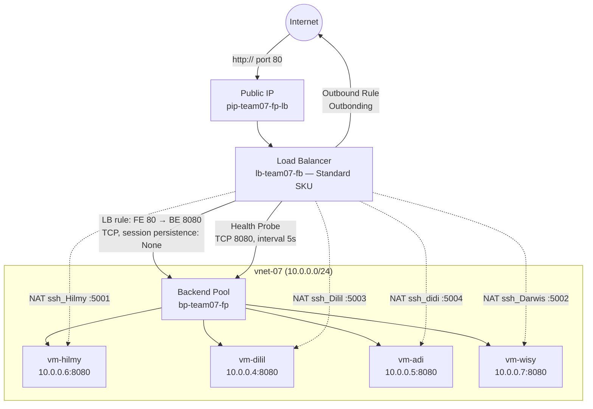
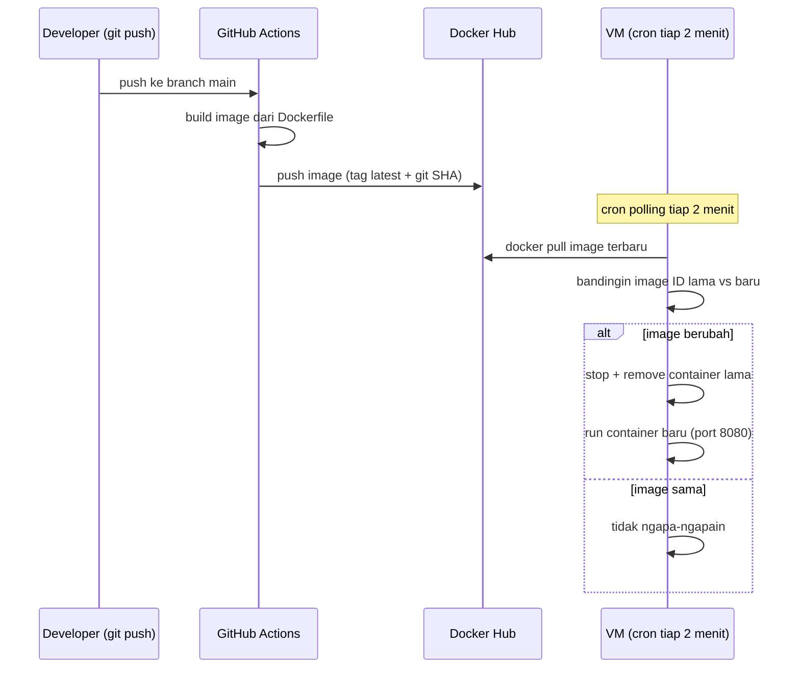

# Laporan Final Project LBE NCC Kelompok 7

|    NRP     |           Nama             |
| :--------: |       :------------:       |
| 5025251052 | Hilmy Fausta Pratama       |
| 5025251041 | Muhammad Adinata Parikesit      |
| 5025251021 | Yahdilil Haq Sarifuddin|
| 5025251036 | Darwisy Ahmad Alfayyadl|

Tiap folder berisi source portofolio masing-masing + `Dockerfile` sendiri-sendiri (struktur & isi beda, karena tiap orang deploy image sendiri ke Docker Hub-nya masing-masing). Lihat `README.md` di dalam tiap folder untuk cara build & run lokal.

## Arsitektur


## Komponen
| Resource | Nama | Detail |
|---|---|---|
| Resource Group | `LBE-NCC-07` | region `indiasouthcentral` |
| Virtual Network | `vnet-07` | `10.0.0.0/16`, subnet `default` (`10.0.0.0/24`) |
| Load Balancer | `lb-team07-fb` | SKU **Standard**, backend pool `bp-team07-fp` |
| Public IP | `pip-team07-fp-lb` | Static, `172.198.228.9` |
| LB Rule | `rule-team07-fp` | Frontend port `80` → backend port `8080`, protokol TCP, load distribution `Default` (= tanpa session persistence) |
| Health Probe | `hp-team07-fp` | TCP port `8080`, interval 5s, threshold 1 |


## Virtual Machines

Semua `Standard_B1s` dengan 1GB ram dan 1vCPU, Ubuntu 24.04 LTS, masing-masing menjalankan satu portofolio dalam container Docker yang listen di port internal **8080** (fixed, dipakai health probe & LB rule).

| VM | Private IP | Anggota | SSH via LB (Inbound NAT rule) |
|---|---|---|---|
| vm-hilmy | 10.0.0.6 | Hilmy | port `5001` → VM port 22 |
| vm-wisy  | 10.0.0.7 | Wisy  | port `5002` → VM port 22 |
| vm-dilil | 10.0.0.4 | Dilil | port `5003` → VM port 22 |
| vm-adi   | 10.0.0.5 | Adi   | port `5004` → VM port 22 |

Setiap VM punya NSG sendiri, dengan rule inbound yang mengizinkan:
- `22` (SSH)
- `80` (HTTP)
- `443` (HTTPS)
- `8080` (app port — dipakai health probe & LB rule)

## Cara Akses
- **App (via Load Balancer):** http://172.198.228.9 (atau `http://kelompok07.indiasouthcentral.cloudapp.azure.com`)
- **SSH ke tiap VM** (VM tidak punya public IP sendiri, akses lewat NAT rule di LB):

  | VM | SSH command |
  |---|---|
  | vm-hilmy | `ssh -p 5001 <user>@172.198.228.9` |
  | vm-adi   | `ssh -p 5004 <user>@172.198.228.9` |
  | vm-dilil | `ssh -p 5003 <user>@172.198.228.9` |
  | vm-wisy  | `ssh -p 5002 <user>@172.198.228.9` |

## Bukti Distribusi Traffic
### command
```bash
for i in $(seq 1 20); do
  HTML=$(curl -s http://172.198.228.9)
  if echo "$HTML" | grep -q "Yahdilil Haq Sarifuddin"; then
    echo "[$i] -> punya Dilil"
  elif echo "$HTML" | grep -q "Darwisy Ahmad Alfayyadl"; then
    echo "[$i] -> punya Darwis"
  elif echo "$HTML" | grep -q "Muhammad Adinata Parikesit"; then
    echo "[$i] -> punya Didi"
  elif echo "$HTML" | grep -q "Hilmy Fausta Pratama"; then
    echo "[$i] -> punya Hilmy"
  fi
  sleep 0.3
done
```
### output
```
[1] -> punya Dilil
[2] -> punya Hilmy
[3] -> punya Hilmy
[4] -> punya Didi
[5] -> punya Didi
[6] -> punya Darwis
[7] -> punya Hilmy
[8] -> punya Hilmy
[9] -> punya Darwis
[10] -> punya Dilil
[11] -> punya Didi
[12] -> punya Dilil
[13] -> punya Didi
[14] -> punya Dilil
[15] -> punya Darwis
[16] -> punya Darwis
[17] -> punya Dilil
[18] -> punya Dilil
[19] -> punya Dilil
[20] -> punya Hilmy
```


