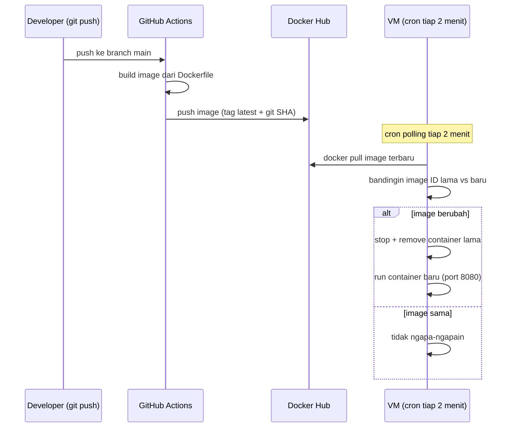

# CI/CD Auto Build & Auto Deploy

push ke main -> github action -> push image docker -> vm narik image terbaru dari polling berkala

Trigger: setiap push ke branch `main`.

Langkah:
1. Checkout repo
2. (kalau ada CSS/JS terpisah) jalankan bundler dulu inline-kan CSS+JS jadi
   satu file HTML, supaya aman dari isu LB Layer-4 yang bisa "memecah"
   request CSS/JS ke VM lain
3. Build image Docker dari Dockerfile yang sudah ada di repo
4. Login ke Docker Hub pakai secrets
5. Push image dengan dua tag `latest` 

**`deploy/update.sh`** :
1. `docker pull` image terbaru sesuai `IMAGE` di `.env`
2. Bandingkan image ID lama vs baru
3. Kalau beda: stop + remove container lama, jalankan container baru dengan
   `HOST_PORT:CONTAINER_PORT` dari `.env` (tetap 8080, sesuai kebutuhan
   health probe & LB rule)
4. Kalau sama: exit tanpa aksi apa pun (idempotent, aman dijalankan tiap
   2 menit lewat cron tanpa efek samping)

