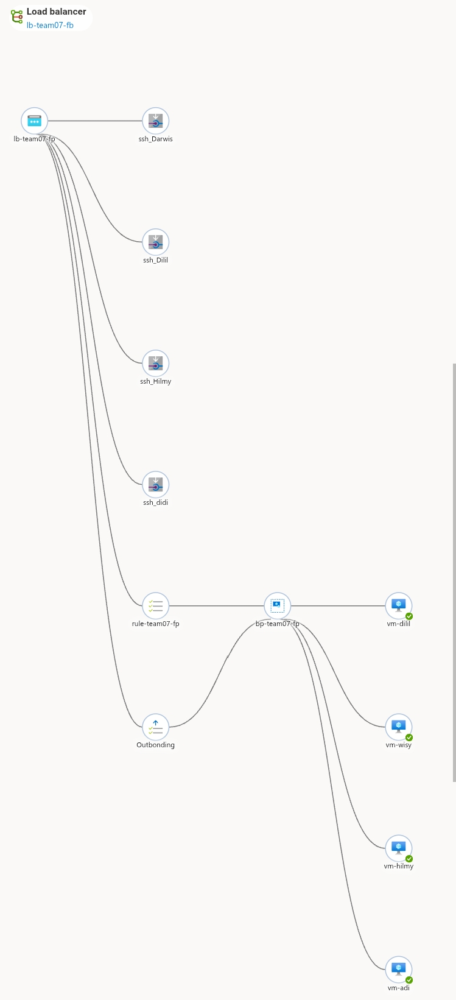
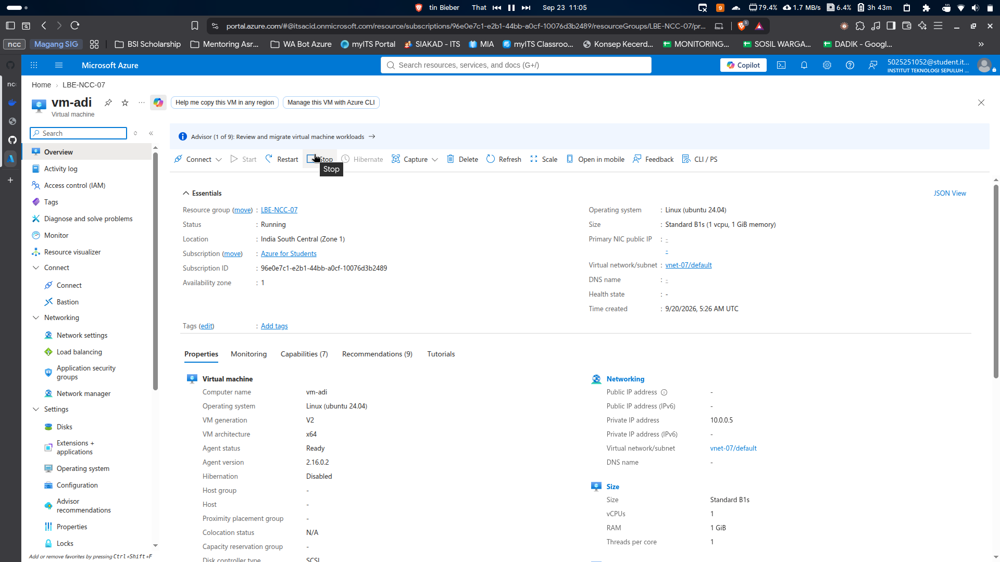
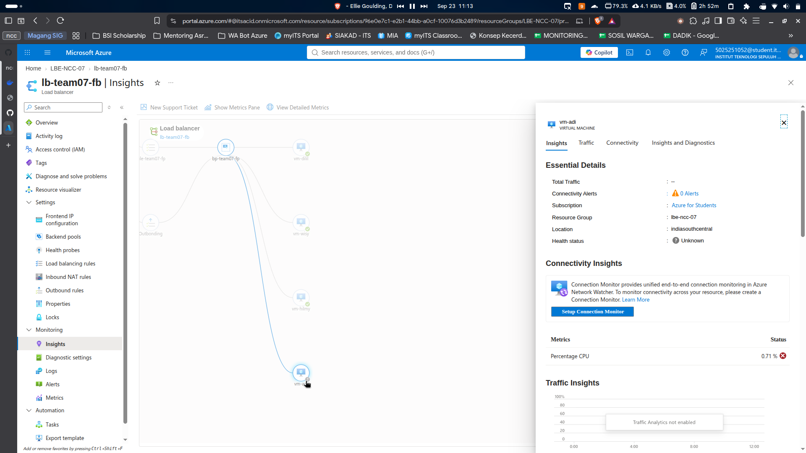
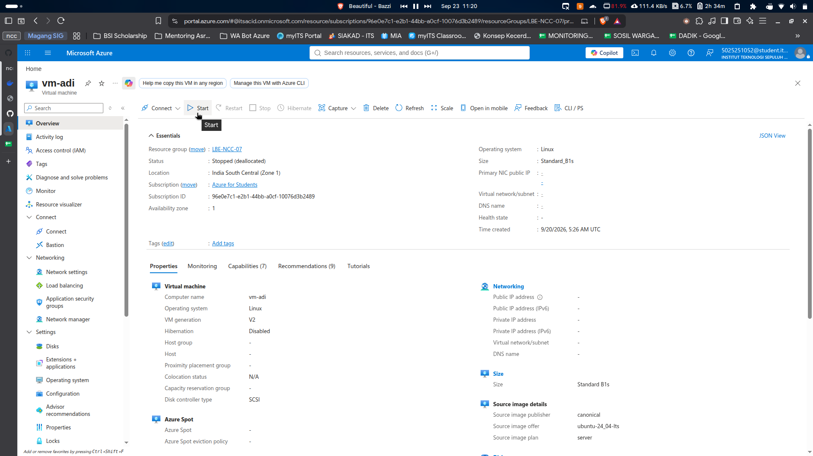
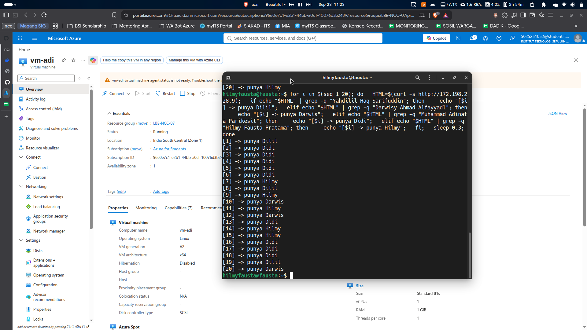
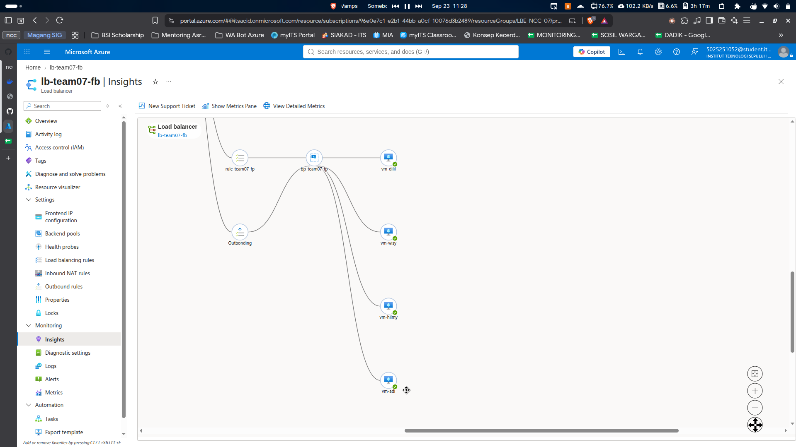

# Simulasi Kegagalan VM

awalnya terdapat 4 VM dan semuanya healthy

setelah disimulasikan 1VM mati

hasil curl setelah vm dimatikan

hasil insight load balancer

setelah vm kembali dinyalakan

curl kembali normal 4 user

insight kembali healthy
