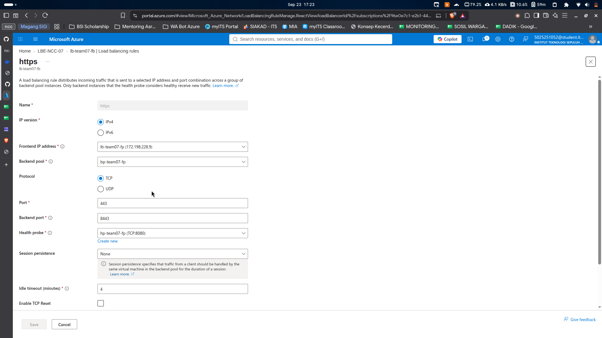

# Ubah HTTP dari HTTPS

install nginx
```
A basic load testing script that visualizes how requests are distributed across your VMs.
```
buat folder dan certificate dengan openssl
```
sudo mkdir -p /etc/nginx/ssl
sudo openssl req -x509 -nodes -days 365 -newkey rsa:2048 \
  -keyout /etc/nginx/ssl/key.pem \
  -out /etc/nginx/ssl/cert.pem \
  -subj "/CN=172.198.228.9"
```

ubah konfigurasi /etc/nginx/sites-available/default menjadi
```
server {
    listen 8443 ssl;
    server_name 172.198.228.9;

    ssl_certificate     /etc/nginx/ssl/cert.pem;
    ssl_certificate_key /etc/nginx/ssl/key.pem;

    location / {
        proxy_pass http://localhost:8080;
        proxy_set_header Host $host;
        proxy_set_header X-Real-IP $remote_addr;
    }
}
```

buat port inbound baru di 8443
dan bikin load balancing rule baru dengan 
